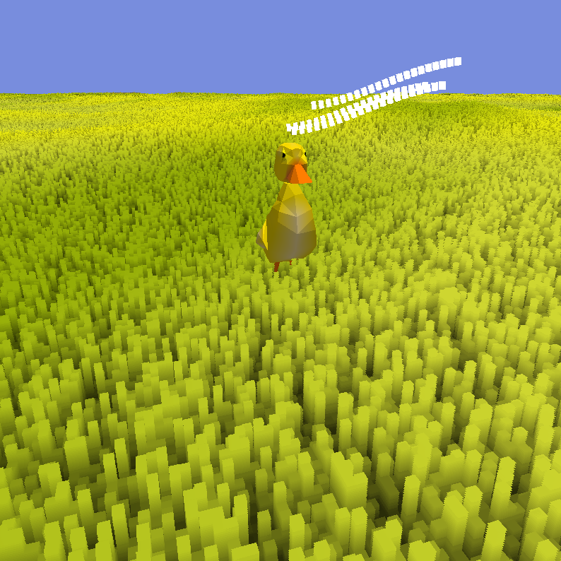

# Duck Demo Game


This project was an assignment I had during my Advanced Computer Graphics class. We were tasked with creating a game anyway we wanted, and so I decided to do it in OpenGL. Most of it was based on [this tutorial](https://learnopengl.com/Introduction), which helped me create the bare bones of the engine. Unfortunately, code architecture is not ideal, but I'm still very proud of all the techniques I managed to implement in the spam of two months.

## Steering Behaviour


The game consists of two ducks: the player and an autonomous agent. The autonomous agent is controlled by a [steering behaviour system](src/controllers/DuckBotController.cpp) with a wander and a seek state. The agent wanders around until it sees the wind, which points in the direction of their nest. If it's close enough to it, then it seeks in the direction of the window.

## Shell Texturing


The grass is rendered using a shader technique called shell texturing. Acerola has a [pretty good video](https://www.youtube.com/watch?v=9dr-tRQzij4) explaining what this is and how to implement it. As you can see [here](shaders/terrain/TerrainV2.frag), it is very easy to implement it and renders cheap grass with a unique style.

## Wind



The wind is composed of simple cubes that follow a trajectory based on [two functions](src/entities/Wind.cpp). Since it is composed of a small number of cubes, all of them are already loaded to the GPU. To render them, the indices of which cubes should be rendered are updated.

## Lighting


Lighting the terrain and the ducks is done using toon shaders. Blades of grass closer to the ground have a darker color set during shell texturing. Deferred shading is not implemented since there were only these two entities that would be lit.

## Duck Model

The ducks were modeled using Blender and loaded with the [LodePNG library](https://lodev.org/lodepng/).

## Running the project

#### First, make sure you have `GLFW` in your system includes.

```cmd
sudo apt-get install libglfw3-dev
```

#### The project is built with CMake. In the main directory, run:

```cmd
mkdir build
cd build
```

#### Inside the build directory, run:

```cmd
cmake ../
cmake --build .
```

#### And finally, run this to execute:

```cmd
./DuckGame
```
